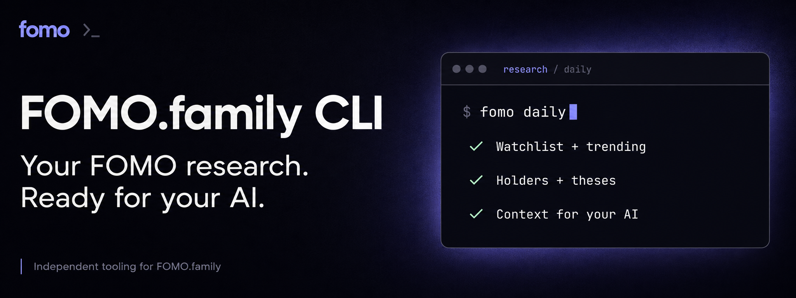

<p align="center">
  
</p>

<h1 align="center">FOMO.family CLI</h1>

<p align="center"><strong>Give your AI the context behind the coins.</strong></p>

<p align="center">Explore what is gaining attention, who holds it, and why they believe in it.<br>Turn your FOMO.family research into a workflow your AI can repeat.</p>

<p align="center"><strong>CLI + MCP</strong> · <strong>Your browser session</strong> · <strong>Your choice of AI</strong> · <strong>Beta</strong></p>

<p align="center">
  <a href="#quick-start">Get started</a> ·
  <a href="#connect-your-ai">Connect your AI</a> ·
  <a href="docs/commands.md">Command guide</a> ·
  <a href="docs/coverage.md">Verified coverage</a>
</p>

## From a busy feed to a focused research brief

The interesting part of a coin is rarely just its price. It is the traders building positions, the thesis behind their conviction, and the change in attention around it. Following all of that means moving between lists, filters, profiles and charts.

**FOMO.family CLI gives your AI a repeatable way to do that work.** It operates [FOMO.family](https://fomo.family) through your own logged-in browser and brings back a focused set of observations. Your AI can turn those observations into a brief, explore a promising lead, or help maintain your watchlist.

You choose the model and the final format. The toolkit handles the browser steps.

## What you can do

| Your question | What the toolkit brings back |
| --- | --- |
| **Where is attention moving?** | Watchlist, Trending and Most held discovery, plus Crypto, Graduated and Bonding views. |
| **Who is involved?** | Holders, followed traders, displayed positions and leaderboard context. |
| **What is the story?** | Theses filtered by Fomo's native minimum size, with position details for selected authors. |
| **What changed since my last read?** | Newly observed thesis text, with previously seen content filtered out. |
| **What deserves a closer look?** | Chart snapshots, timeframe controls and trader overlays for your AI or your own review. |
| **What do I want to keep following?** | Explicit watchlist additions and removals, verified after reloading. |

## One command. A repeatable starting point.

```sh
fomo daily --limit 3 --rows 5 --min-size-usd 10000
```

This combines Watchlist, Trending and Most held, prioritizes overlap, and examines up to three candidates. For each, it collects an overview, Friends-only holders and a small sample of filtered theses. Your AI receives structured context with sources, timestamps and coverage limits.

Then ask your connected AI:

> Run my FOMO.family research. Show me which coins deserve attention, which traders I follow are involved, and the thesis and counterargument for each. Keep it short and tell me what is still uncertain.

The command collects the evidence; **your AI writes the brief**. The workflow does not place trades or automatically edit your watchlist.

### Read the relevant theses, not the entire history

A coin can have thousands of theses. Start with a native minimum-size filter, read a limited sample, and open the position details for the authors that merit attention. On the next run, `--since-last` avoids sending unchanged observed thesis text again.

This is selective research, not a complete historical archive. A displayed position value is also not proof of a fresh purchase for that amount. [How filters and evidence work →](docs/research.md)

## Quick start

You need **Node.js 22+**, **Google Chrome**, Git and a FOMO.family account. Windows and macOS are the intended browser environments. Use a terminal with access to this repository.

**1. Install the toolkit**

```sh
git clone https://github.com/Trilokx/fomo-family-cli.git
cd fomo-family-cli
npm ci
npm install --global .
```

**2. Connect your FOMO.family account**

```sh
fomo login
```

Sign in in the dedicated Chrome window, then close **that window only**. Your regular Chrome profile stays separate.

**3. Run your first research pass**

```sh
fomo start
fomo account
fomo daily --limit 3
```

The browser session is reused between commands. No model API key is required by the collector. [Installation and login help →](docs/installation.md)

## Connect your AI

Use the **CLI** with an agent that can run terminal commands, or connect the **MCP server** to a compatible AI client. Both use the same 17 tools and the same browser session.

```sh
fomo mcp-config
```

Copy the generated configuration into your AI client's MCP settings. It contains the correct paths for your installation. Give the agent the included [FOMO.family skill](skills/fomo/SKILL.md) so it knows which tools to use, how to read selectively, and how to interpret the results.

An optional Codex plugin package is included. [Connection details →](docs/installation.md) · [All commands →](docs/commands.md)

## Built to spend model work on interpretation

Navigation, clicking, filtering and extraction run as predefined code. **The collector makes zero LLM calls.** Your model reads the collected context instead of deciding every browser action from scratch.

Small result budgets and thesis deduplication keep routine reads focused. Your AI's prompts, tool results, reasoning and chart interpretation still use tokens; no comparative cost-saving percentage is claimed. [Cost model and measured examples →](docs/costs.md)

## Your account. Your workflow.

- **Local session:** sign in on your machine; browser state and evidence stay in the local runtime directory.
- **Flexible output:** use your AI to produce a short brief, a research dossier or your own downstream format.
- **Schedule when ready:** the daily workflow is available to your scheduler; the package creates no background schedule by itself.
- **Explicit actions:** watchlist changes have their own commands. Orders, transfers, posts and follows are outside this toolkit.

## Built, tested, and clear about its limits

The beta has live verification for discovery lists, thesis filters, holders, trader profiles, charts, layouts and watchlist changes. Automated checks cover installation, TypeScript, parsing, tool contracts and MCP transport across Windows, macOS and Linux.

Fomo UI changes and session expiry can require attention. Results describe the rows actually collected; full history and reliable unattended operation are not guaranteed. [See the verification matrix and current limitations →](docs/coverage.md)

## Explore further

| Guide | Start here when you want to… |
| --- | --- |
| [Command guide](docs/commands.md) | Explore individual tools and filters. |
| [Research semantics](docs/research.md) | Understand what the data does and does not establish. |
| [Daily workflow](docs/daily-workflow.md) | Adapt the research prompt to your own routine. |
| [Installation](docs/installation.md) | Configure sessions, MCP and troubleshooting. |
| [Contributing](CONTRIBUTING.md) | Report a problem or improve a workflow. |

Found a broken flow? [Open an issue](https://github.com/Trilokx/fomo-family-cli/issues/new/choose) with the command and redacted error. Never include browser profiles, cookies or private account evidence.

---

Built by **TRLX**. Open-source beta under the [MIT License](LICENSE). Independent tooling for **FOMO.family**, without affiliation or endorsement. The Fomo name and visual identity belong to their respective owners; the software license grants no rights to third-party trademarks or branding. Banner artwork illustrates the workflow.
